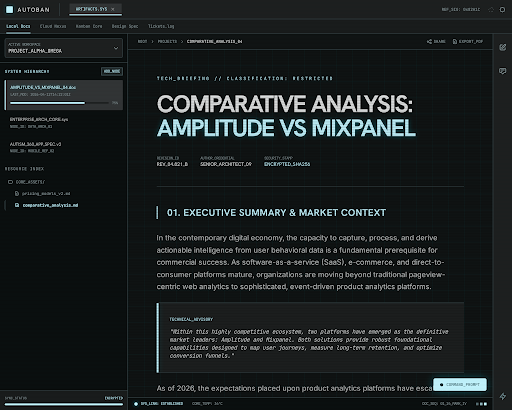
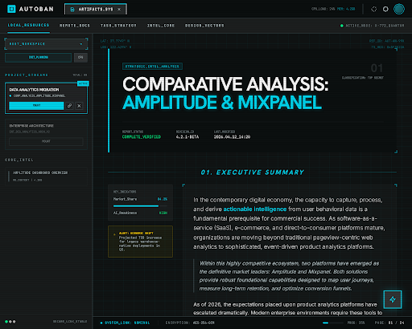
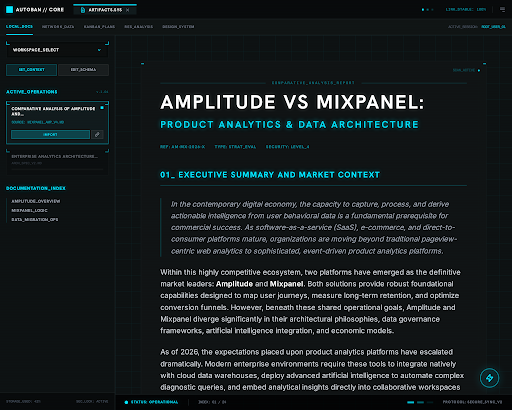
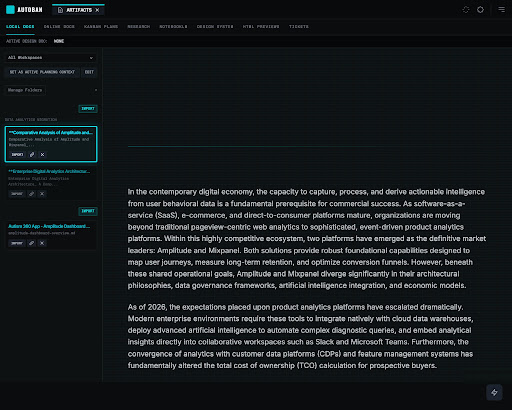
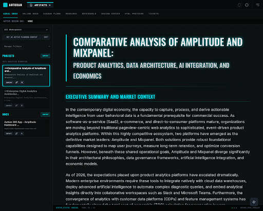
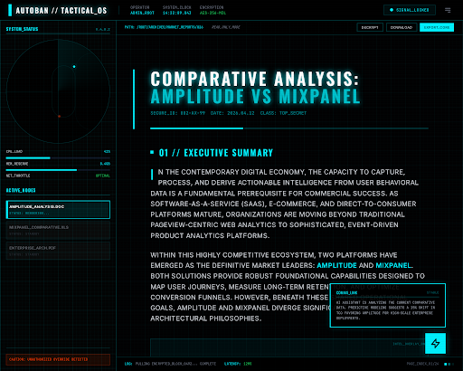
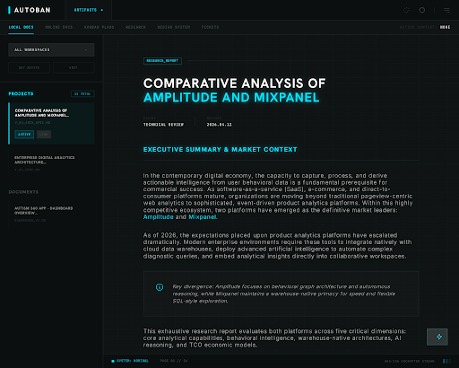
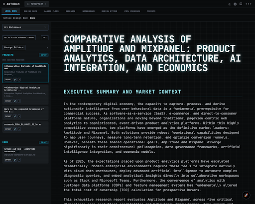

# Design Handoff - Project 10893744219177716504

Sync timestamp: 2026-06-11T05:16:55.035Z

## Screens

### Neon Tactical - Technical Brief Variant
- Device: DESKTOP
- HTML: [13d883acb23749b4baa647cfd157c2a1.html](./screens/13d883acb23749b4baa647cfd157c2a1.html)
- Image: 

### Neon Tactical - Mission Control Variant
- Device: DESKTOP
- HTML: [e034bebc2aa94613b78293da141c9e94.html](./screens/e034bebc2aa94613b78293da141c9e94.html)
- Image: 

### Variant 1: High-Density HUD
- Device: DESKTOP
- HTML: [252bf922f4a24527a9b803cdda37582c.html](./screens/252bf922f4a24527a9b803cdda37582c.html)
- Image: 

### Variant 2: Industrial Monotonic
- Device: DESKTOP
- HTML: [d99ac4f6f31b43c9a7e6eefd05c5be9c.html](./screens/d99ac4f6f31b43c9a7e6eefd05c5be9c.html)
- Image: 

### Modern Aerospace - Scanline Variant
- Device: DESKTOP
- HTML: [a6291fca3e8341fdb4e38a35b755d943.html](./screens/a6291fca3e8341fdb4e38a35b755d943.html)
- Image: 

### Documentation - Modern Aerospace Variant
- Device: DESKTOP
- HTML: [8b35abeb4bd641509cf1fd7f07a47331.html](./screens/8b35abeb4bd641509cf1fd7f07a47331.html)
- Image: 

### Neon Tactical - Immersive Console Variant
- Device: DESKTOP
- HTML: [077c9647a33b4f2198ad1ba8563402d6.html](./screens/077c9647a33b4f2198ad1ba8563402d6.html)
- Image: 

### Variant 3: Clean Aerospace
- Device: DESKTOP
- HTML: [25eccd494b5d4fb7bdb3b8e616f6ddfd.html](./screens/25eccd494b5d4fb7bdb3b8e616f6ddfd.html)
- Image: 

### Documentation - Retro Terminal Variant
- Device: DESKTOP
- HTML: [6950175c9e48498a8ed5fb06bfcc35cb.html](./screens/6950175c9e48498a8ed5fb06bfcc35cb.html)
- Image: 

> Skipped (no download URLs yet — re-sync later): Neon Tactical Design Specification, Neon Tactical - Typography Fix Spec, switchboard2.png

## Design Systems

### assets/279cf310feb748ba88c088734a0adb2f

```json
{
  "designSystem": {
    "displayName": "Neon Tactical",
    "styleGuidelines": "## Brand & Style\n\nThe design system embodies a **Tactical / Cybernetic** aesthetic, designed for high-performance data environments and technical documentation. It targets power users, developers, and analysts who require a high-density, low-distraction interface that feels like a mission-critical terminal.\n\nThe personality is precise, authoritative, and futuristic. It leverages a \"Dark Mode First\" philosophy, utilizing deep obsidian backgrounds to make high-contrast neon accents pop. The visual language is heavily influenced by **Brutalism** (sharp edges, visible grids) and **Modern HUD (Heads-Up Display)** interfaces, prioritizing functional clarity over decorative softness.\n\nKey characteristics include:\n- **High-Density Information:** Tight spacing to maximize data visibility.\n- **Luminous Hierarchy:** Using outer glows and neon strokes to indicate focus and priority.\n- **Structural Integrity:** Visible grid lines and borders that ground the UI in a logical, mathematical framework.\n\n## Layout & Spacing\n\nThe layout is strictly **Grid-Based**, utilizing a visible 12-column system on desktop. \n\n- **The Global Grid:** A subtle background grid (16px or 32px increments) should be visible in the main content area to provide a \"blueprint\" feel.\n- **Sidebar Architecture:** A fixed-width left sidebar contains navigation and resource lists, separated by a high-contrast vertical border.\n- **Density:** Padding is intentionally compact (8px to 16px) to accommodate dense technical data. \n- **Responsive Behavior:** On mobile, the sidebar collapses into a drawer, and the grid shifts to a 4-column layout with 16px margins. Content cards stack vertically, maintaining their sharp borders.\n\n## Elevation & Depth\n\nDepth is not communicated through traditional soft shadows, but through **Tonal Layering** and **Luminous Strokes**.\n\n- **Z-0 (Background):** Pure black (#050505) with a faint tertiary-colored grid overlay.\n- **Z-1 (Surfaces):** Dark gray (#1A1A1A) with a 1px solid border (#2A2A2A).\n- **Active State:** Elements in focus or \"active\" receive a primary cyan border and a soft outer glow (0px 0px 8px).\n- **Dividers:** Use 1px solid lines in the tertiary color. Avoid all heavy shadows; the UI should feel flat and \"projected\" rather than physically stacked.\n\n## Components\n\n### Buttons & Inputs\n- **Primary Action:** Sharp corners, primary color background, black text. High-intensity glow on hover.\n- **Ghost Action:** 1px border in primary or neutral color. No background.\n- **Inputs:** Dark background (#000), 1px neutral border that turns primary cyan on focus. Labels sit just above the input in `label-caps`.\n\n### Cards & Containers\n- Cards use a secondary background color with sharp corners. \n- Active cards feature a left-accent border in primary cyan.\n- Content inside cards follows a tight hierarchy: `label-caps` for category, `headline-md` for title, `body-sm` for description.\n\n### Tabs & Navigation\n- Top navigation uses `label-caps` with a 2px bottom border indicator for the active state.\n- Hover states should trigger a subtle brightness increase or a primary color text change.\n\n### Chips & Badges\n- Small, rectangular boxes with `mono-data` text. Use low-opacity primary backgrounds (e.g., 15% cyan) to signify status without overwhelming the screen.",
    "theme": {
      "bodyFont": "INTER",
      "bodyFontFamily": "Inter",
      "colorMode": "DARK",
      "colorVariant": "FIDELITY",
      "customColor": "#00e5ff",
      "designMd": "---\nname: Neon Tactical\ncolors:\n  surface: '#101414'\n  surface-dim: '#101414'\n  surface-bright: '#363a3a'\n  surface-container-lowest: '#0b0f0f'\n  surface-container-low: '#191c1c'\n  surface-container: '#1d2020'\n  surface-container-high: '#272b2b'\n  surface-container-highest: '#323536'\n  on-surface: '#e1e3e3'\n  on-surface-variant: '#bac9cc'\n  inverse-surface: '#e1e3e3'\n  inverse-on-surface: '#2e3131'\n  outline: '#849396'\n  outline-variant: '#3b494c'\n  surface-tint: '#00daf3'\n  primary: '#c3f5ff'\n  on-primary: '#00363d'\n  primary-container: '#00e5ff'\n  on-primary-container: '#00626e'\n  inverse-primary: '#006875'\n  secondary: '#c8c6c5'\n  on-secondary: '#313030'\n  secondary-container: '#474746'\n  on-secondary-container: '#b7b5b4'\n  tertiary: '#e6eeee'\n  on-tertiary: '#2a3232'\n  tertiary-container: '#c9d2d1'\n  on-tertiary-container: '#525a5a'\n  error: '#ffb4ab'\n  on-error: '#690005'\n  error-container: '#93000a'\n  on-error-container: '#ffdad6'\n  primary-fixed: '#9cf0ff'\n  primary-fixed-dim: '#00daf3'\n  on-primary-fixed: '#001f24'\n  on-primary-fixed-variant: '#004f58'\n  secondary-fixed: '#e5e2e1'\n  secondary-fixed-dim: '#c8c6c5'\n  on-secondary-fixed: '#1c1b1b'\n  on-secondary-fixed-variant: '#474746'\n  tertiary-fixed: '#dce4e4'\n  tertiary-fixed-dim: '#c0c8c8'\n  on-tertiary-fixed: '#151d1d'\n  on-tertiary-fixed-variant: '#404848'\n  background: '#101414'\n  on-background: '#e1e3e3'\n  surface-variant: '#323536'\ntypography:\n  headline-lg:\n    fontFamily: Hanken Grotesk\n    fontSize: 32px\n    fontWeight: '700'\n    lineHeight: '1.2'\n    letterSpacing: -0.02em\n  headline-md:\n    fontFamily: Hanken Grotesk\n    fontSize: 20px\n    fontWeight: '600'\n    lineHeight: '1.4'\n  body-base:\n    fontFamily: Inter\n    fontSize: 15px\n    fontWeight: '400'\n    lineHeight: '1.6'\n  body-sm:\n    fontFamily: Inter\n    fontSize: 13px\n    fontWeight: '400'\n    lineHeight: '1.5'\n  label-caps:\n    fontFamily: JetBrains Mono\n    fontSize: 11px\n    fontWeight: '700'\n    lineHeight: '1'\n    letterSpacing: 0.1em\n  mono-data:\n    fontFamily: JetBrains Mono\n    fontSize: 12px\n    fontWeight: '400'\n    lineHeight: '1'\nspacing:\n  unit: 4px\n  gutter: 16px\n  margin: 24px\n  sidebar_width: 280px\n---\n\n## Brand & Style\n\nThe design system embodies a **Tactical / Cybernetic** aesthetic, designed for high-performance data environments and technical documentation. It targets power users, developers, and analysts who require a high-density, low-distraction interface that feels like a mission-critical terminal.\n\nThe personality is precise, authoritative, and futuristic. It leverages a \"Dark Mode First\" philosophy, utilizing deep obsidian backgrounds to make high-contrast neon accents pop. The visual language is heavily influenced by **Brutalism** (sharp edges, visible grids) and **Modern HUD (Heads-Up Display)** interfaces, prioritizing functional clarity over decorative softness.\n\nKey characteristics include:\n- **High-Density Information:** Tight spacing to maximize data visibility.\n- **Luminous Hierarchy:** Using outer glows and neon strokes to indicate focus and priority.\n- **Structural Integrity:** Visible grid lines and borders that ground the UI in a logical, mathematical framework.\n\n## Colors\n\nThe palette is rooted in a \"Deep Space\" black foundation, ensuring maximum contrast for the cyan-heavy primary accents.\n\n- **Primary (Electric Cyan):** Used for active states, primary buttons, and glow effects. It represents action and focus.\n- **Secondary (Obsidian):** The surface color for cards and sidebars, providing subtle separation from the pure black background.\n- **Tertiary (Deep Teal):** A muted, dark teal used for secondary borders and background grid lines to maintain the \"tactical\" feel without being distracting.\n- **Neutral (Cool Gray):** Reserved for body text and inactive metadata, ensuring secondary information stays in the background.\n\nColor should be applied with high intentionality—most of the UI remains monochrome, with color reserved for interactive or highlighted elements.\n\n## Typography\n\nTypography in this design system balances modern readability with a technical edge.\n\n- **Headlines:** Set in a bold, contemporary Sans-Serif. Large headlines often feature a subtle text-shadow or \"glow\" to mimic a backlit display.\n- **Body:** Uses a highly legible, neutral Sans-Serif for long-form reading. Line heights are kept generous (1.6) to ensure clarity against the dark background.\n- **Labels & UI:** Utilize a Monospaced font for buttons, tabs, and metadata. This reinforces the \"tactical\" and \"coded\" nature of the system.\n\nLarge display headlines should be truncated or wrapped carefully to maintain the rigid grid structure.\n\n## Layout & Spacing\n\nThe layout is strictly **Grid-Based**, utilizing a visible 12-column system on desktop. \n\n- **The Global Grid:** A subtle background grid (16px or 32px increments) should be visible in the main content area to provide a \"blueprint\" feel.\n- **Sidebar Architecture:** A fixed-width left sidebar contains navigation and resource lists, separated by a high-contrast vertical border.\n- **Density:** Padding is intentionally compact (8px to 16px) to accommodate dense technical data. \n- **Responsive Behavior:** On mobile, the sidebar collapses into a drawer, and the grid shifts to a 4-column layout with 16px margins. Content cards stack vertically, maintaining their sharp borders.\n\n## Elevation & Depth\n\nDepth is not communicated through traditional soft shadows, but through **Tonal Layering** and **Luminous Strokes**.\n\n- **Z-0 (Background):** Pure black (#050505) with a faint tertiary-colored grid overlay.\n- **Z-1 (Surfaces):** Dark gray (#1A1A1A) with a 1px solid border (#2A2A2A).\n- **Active State:** Elements in focus or \"active\" receive a primary cyan border and a soft outer glow (0px 0px 8px).\n- **Dividers:** Use 1px solid lines in the tertiary color. Avoid all heavy shadows; the UI should feel flat and \"projected\" rather than physically stacked.\n\n## Shapes\n\nThe design system uses a **Sharp (0px)** corner radius for almost all components. This reinforces the brutalist, tactical aesthetic. \n\nSlight rounding (Soft - 2px) is only permissible for very small nested elements like checkboxes or inner tag indicators if absolutely necessary for visual distinction, but the default remains square. This sharp geometry ensures that all elements align perfectly with the background grid.\n\n## Components\n\n### Buttons & Inputs\n- **Primary Action:** Sharp corners, primary color background, black text. High-intensity glow on hover.\n- **Ghost Action:** 1px border in primary or neutral color. No background.\n- **Inputs:** Dark background (#000), 1px neutral border that turns primary cyan on focus. Labels sit just above the input in `label-caps`.\n\n### Cards & Containers\n- Cards use a secondary background color with sharp corners. \n- Active cards feature a left-accent border in primary cyan.\n- Content inside cards follows a tight hierarchy: `label-caps` for category, `headline-md` for title, `body-sm` for description.\n\n### Tabs & Navigation\n- Top navigation uses `label-caps` with a 2px bottom border indicator for the active state.\n- Hover states should trigger a subtle brightness increase or a primary color text change.\n\n### Chips & Badges\n- Small, rectangular boxes with `mono-data` text. Use low-opacity primary backgrounds (e.g., 15% cyan) to signify status without overwhelming the screen.",
      "font": "HANKEN_GROTESK",
      "headlineFont": "HANKEN_GROTESK",
      "headlineFontFamily": "Hanken Grotesk",
      "labelFont": "JETBRAINS_MONO",
      "labelFontFamily": "Jetbrains Mono",
      "namedColors": {
        "background": "#101414",
        "error": "#ffb4ab",
        "error_container": "#93000a",
        "inverse_on_surface": "#2e3131",
        "inverse_primary": "#006875",
        "inverse_surface": "#e1e3e3",
        "on_background": "#e1e3e3",
        "on_error": "#690005",
        "on_error_container": "#ffdad6",
        "on_primary": "#00363d",
        "on_primary_container": "#00626e",
        "on_primary_fixed": "#001f24",
        "on_primary_fixed_variant": "#004f58",
        "on_secondary": "#313030",
        "on_secondary_container": "#b7b5b4",
        "on_secondary_fixed": "#1c1b1b",
        "on_secondary_fixed_variant": "#474746",
        "on_surface": "#e1e3e3",
        "on_surface_variant": "#bac9cc",
        "on_tertiary": "#2a3232",
        "on_tertiary_container": "#525a5a",
        "on_tertiary_fixed": "#151d1d",
        "on_tertiary_fixed_variant": "#404848",
        "outline": "#849396",
        "outline_variant": "#3b494c",
        "primary": "#c3f5ff",
        "primary_container": "#00e5ff",
        "primary_fixed": "#9cf0ff",
        "primary_fixed_dim": "#00daf3",
        "secondary": "#c8c6c5",
        "secondary_container": "#474746",
        "secondary_fixed": "#e5e2e1",
        "secondary_fixed_dim": "#c8c6c5",
        "surface": "#101414",
        "surface_bright": "#363a3a",
        "surface_container": "#1d2020",
        "surface_container_high": "#272b2b",
        "surface_container_highest": "#323536",
        "surface_container_low": "#191c1c",
        "surface_container_lowest": "#0b0f0f",
        "surface_dim": "#101414",
        "surface_tint": "#00daf3",
        "surface_variant": "#323536",
        "tertiary": "#e6eeee",
        "tertiary_container": "#c9d2d1",
        "tertiary_fixed": "#dce4e4",
        "tertiary_fixed_dim": "#c0c8c8"
      },
      "overrideNeutralColor": "#8e9191",
      "overridePrimaryColor": "#00e5ff",
      "overrideSecondaryColor": "#1a1a1a",
      "overrideTertiaryColor": "#0f1717",
      "spacing": {
        "gutter": "16px",
        "margin": "24px",
        "sidebar_width": "280px",
        "unit": "4px"
      },
      "spacingScale": 2,
      "typography": {
        "body-base": {
          "fontFamily": "Inter",
          "fontSize": "15px",
          "fontWeight": "400",
          "lineHeight": "1.6"
        },
        "body-sm": {
          "fontFamily": "Inter",
          "fontSize": "13px",
          "fontWeight": "400",
          "lineHeight": "1.5"
        },
        "headline-lg": {
          "fontFamily": "Hanken Grotesk",
          "fontSize": "32px",
          "fontWeight": "700",
          "letterSpacing": "-0.02em",
          "lineHeight": "1.2"
        },
        "headline-md": {
          "fontFamily": "Hanken Grotesk",
          "fontSize": "20px",
          "fontWeight": "600",
          "lineHeight": "1.4"
        },
        "label-caps": {
          "fontFamily": "JetBrains Mono",
          "fontSize": "11px",
          "fontWeight": "700",
          "letterSpacing": "0.1em",
          "lineHeight": "1"
        },
        "mono-data": {
          "fontFamily": "JetBrains Mono",
          "fontSize": "12px",
          "fontWeight": "400",
          "lineHeight": "1"
        }
      }
    }
  },
  "name": "assets/279cf310feb748ba88c088734a0adb2f",
  "version": "1",
  "projectId": "10893744219177716504"
}
```

