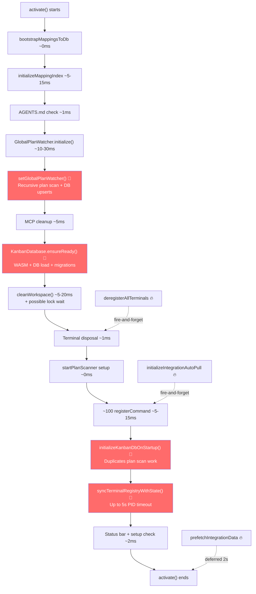

# Switchboard Startup Analysis — Comprehensive Report

## 📋 Executive Summary

The Switchboard extension's startup sequence runs on every VS Code startup via the `onStartupFinished` activation event. Currently, the `activate()` function spans **2,130 lines** of code in [extension.ts](file:///Users/patrickvuleta/Documents/GitHub/switchboard/src/extension.ts#L396-L2527). It contains several sequential `await` blocks that block extension host activation and VS Code startup.

### 🔴 The Top 5 Blocking Bottlenecks

The slow startup is caused by **5 blocking `await`ed operations** that run sequentially on the critical path:

| Rank | Operation | What it does | Cost |
| :--- | :--- | :--- | :--- |
| **#1** | `setGlobalPlanWatcher()` | Recursively reads **every** plan `.md` file + DB upsert per file | Scales with plan count |
| **#2** | `initializeKanbanDbOnStartup()` | **Duplicates #1** — re-scans the same plan files + DB reconciliation | Scales with plan count |
| **#3** | `KanbanDatabase.ensureReady()` | Loads `sql.js` WASM + reads entire DB file + runs 29 migrations | Heavy on first call |
| **#4** | `syncTerminalRegistryWithState()` | Resolves PIDs for every open terminal with a **5-second timeout** | Up to 5s wall clock |
| **#5** | `cleanWorkspace()` | File lock on `state.json` — can stall if contended | 5ms–1s |

---

### 🟡 Unnecessary Eager Loading

The following operations run eagerly at startup but are not required before the user opens or interacts with the Switchboard panel:

*   **AGENTS.md migration** — Version-gated check that only needs to run when the extension version changes.
*   **MCP config cleanup** (6 files) — One-time cleanup script checking multiple files in the home directory.
*   **Plan Scanner** — Active filesystem polling for IDE plans that the user may never view.
*   **Integration auto-pull** — ClickUp/Linear polling timers that boot even if no integrations are configured.
*   **API prefetch** — Eager network calls (ClickUp/Linear/Notion) made after a 2-second delay.
*   **~100 command registrations** — Large volume of commands registered eagerly rather than dynamically or lazily.

---

### 🧠 Core Problems

*   **Zero Lazy Loading:** Everything initializes eagerly, even if the user never opens the Switchboard sidebar or uses its features.
*   **Duplicate Work:** Plan files are recursively scanned and reconciled twice (once by `GlobalPlanWatcher` and once by `initializeKanbanDbOnStartup`).
*   **Sequential Chain:** All major blocking operations run in a serialized chain rather than being parallelized or deferred.
*   **Invisible Bottlenecks:** There is only one timing checkpoint (`cleanWorkspace completed`) in a 2,130-line function, rendering performance degradation invisible.
*   **Massive Module Sizes:** [TaskViewerProvider.ts](file:///Users/patrickvuleta/Documents/GitHub/switchboard/src/services/TaskViewerProvider.ts) (825KB) and [KanbanProvider.ts](file:///Users/patrickvuleta/Documents/GitHub/switchboard/src/services/KanbanProvider.ts) (359KB) must be parsed at startup.

---

## 🔍 Deep-Dive Investigation: User-Raised Points & Root Causes

### 1. `state.json` Does NOT Exist on Disk Anymore
[stateConfigBridge.ts](file:///Users/patrickvuleta/Documents/GitHub/switchboard/src/services/stateConfigBridge.ts#L4-L8) confirms that legacy `.switchboard/state.json` reads/writes are redirected to the `kanban.db` `config` table:

```typescript
// Bridge that redirects legacy `.switchboard/state.json` reads/writes to the
// kanban.db `config` table. state.json no longer exists on disk; the ~40
// legacy call sites that still speak "read/write state.json" go through this
// facade until they are individually converted to direct db calls.
```

**How the Bridge Works:**
*   [extension.ts line 4](file:///Users/patrickvuleta/Documents/GitHub/switchboard/src/extension.ts#L4) imports `stateFs as fs` from `./services/stateConfigBridge`.
*   `fs.existsSync('...state.json')` **always returns `true`** (intercepted path).
*   `fs.readFileSync('...state.json')` **synthesizes JSON from `kanban.db` config table** via `db.getConfigJsonSync()`.
*   `fs.promises.writeFile('...state.json', ...)` **writes to `kanban.db` config table**.
*   The lock (`stateLockfile`) is a **no-op**; serialization is handled by the single `KanbanDatabase` instance.

**The Problem: Legacy Code Still Pays a Bridge Tax**
Despite the bridge, **~40+ call sites** still operate as if `state.json` exists. The critical one during startup is [syncTerminalRegistryWithState()](file:///Users/patrickvuleta/Documents/GitHub/switchboard/src/extension.ts#L1624-L1725):
```typescript
// Line 1627-1628: This check always passes (bridge returns true)
const statePath = path.join(workspaceRoot, '.switchboard', 'state.json');
if (!fs.existsSync(statePath)) return; // ← NEVER returns, bridge fakes it

// Line 1637: This "file read" is actually a DB round-trip
state = JSON.parse(fs.readFileSync(statePath, 'utf8'));
// → bridge calls synthesizeStateJson(db)
// → which iterates 16 config keys, calling db.getConfigJsonSync() for each
```
The retry loop (3 attempts × 50ms delay) for "truncated state.json mid-write" at [lines 1631–1643](file:///Users/patrickvuleta/Documents/GitHub/switchboard/src/extension.ts#L1631-L1643) is **dead code** (the bridge never produces a truncated result), but the parsing code still executes.

---

### 2. Why Are MD Files Scanned When the Kanban Is Built from DB?
The database **is** the source of truth, but the startup code does not fully trust it. There are **two separate startup scan paths**, and only one of them respects the DB-first principle:

#### Scan A: `setGlobalPlanWatcher()` — **Unconditional, Full Scan** 🔴
[KanbanProvider.ts lines 390–405](file:///Users/patrickvuleta/Documents/GitHub/switchboard/src/services/KanbanProvider.ts#L390-L405):
```typescript
// Initial scan: import plans that exist on disk before watchers started
const folders = this._getWatchFolders();
for (const folder of folders) {
    const db = this._getKanbanDb(folder);
    await db.ensureReady();
    const wsId = await db.getWorkspaceId();
    await this._globalPlanWatcher.triggerScan(folder); // ← FULL SCAN, ALWAYS
}
```
This calls [triggerScan()](file:///Users/patrickvuleta/Documents/GitHub/switchboard/src/services/GlobalPlanWatcherService.ts#L594-L624) which:
1.  **Recursively walks** `.switchboard/plans/` via `readdir`.
2.  For **every `.md` file**, calls `_handlePlanFile()` which:
    *   `db.ensureReady()` (cached, cheap)
    *   `db.getPlanByPlanFile()` — DB query
    *   `fs.promises.readFile()` — **reads the entire file content**
    *   `parsePlanMetadata(content)` — regex parsing
    *   `fs.promises.stat()` — file stat for mtime
    *   `db.upsertPlans()` — **DB write**
    *   Possibly `clickUp.debouncedSync()` — network call per file.

> [!CAUTION]
> **This runs unconditionally on every startup.** It doesn't check whether the DB already has the plan data. For 50 plans, that's 50 file reads + 50 parses + 50 DB upserts + 50 stats — on every VS Code window open.

#### Scan B: `initializeKanbanDbOnStartup()` — **DB-First, Conditional** ✅
[TaskViewerProvider.ts lines 2250–2267](file:///Users/patrickvuleta/Documents/GitHub/switchboard/src/services/TaskViewerProvider.ts#L2250-L2267):
```typescript
const hasPlans = await db.hasActivePlans(wsId);
if (hasPlans) {
    // DB-first: DB already has data. Just run cleanup, do NOT re-sync from files.
    console.log(`DB already populated, skipping file sync`);
    await db.cleanupSpuriousMirrorPlans(wsId); // lightweight
} else {
    // First boot or empty DB: bootstrap from runsheets (one-time)
    await this._collectAndSyncKanbanSnapshot(workspaceRoot, true);
}
```
This one **correctly** checks `hasActivePlans()` first and only does a full file scan on first boot. But **it doesn't matter** — by the time this runs, `setGlobalPlanWatcher()` has already read and upserted every file.

---

## 📅 Activation Sequence (Chronological)

The table below shows every significant operation in `activate()`, whether it **blocks** (is `await`ed), and what I/O it performs.

| # | Operation | Line | Blocking? | I/O Type | Steady-State Cost |
|---|-----------|------|-----------|----------|-------------------|
| 1 | `bootstrapMappingsToDb()` | [407](file:///Users/patrickvuleta/Documents/GitHub/switchboard/src/extension.ts#L407) | ✅ `await` | globalState check → short-circuits | **~0ms** |
| 2 | `initializeMappingIndex()` | [408](file:///Users/patrickvuleta/Documents/GitHub/switchboard/src/extension.ts#L408) | ✅ `await` | N × sync file reads + SQLite opens/queries | **~5–15ms** (1 folder) |
| 3 | `new KanbanProvider()` | [415](file:///Users/patrickvuleta/Documents/GitHub/switchboard/src/extension.ts#L415) | Sync | Workspace folder scan | **~1ms** |
| 4 | AGENTS.md migration | [421–440](file:///Users/patrickvuleta/Documents/GitHub/switchboard/src/extension.ts#L421-L440) | ✅ Conditional | 2 sync file reads → usually skipped | **~1ms** (same version) |
| 5 | **`GlobalPlanWatcher.initialize()`** | [446](file:///Users/patrickvuleta/Documents/GitHub/switchboard/src/extension.ts#L446) | ✅ `await` | Watcher setup (sync), heavy scan is fire-and-forget | **~10–30ms** |
| 6 | **`kanbanProvider.setGlobalPlanWatcher()`** | [450](file:///Users/patrickvuleta/Documents/GitHub/switchboard/src/extension.ts#L450) | ✅ `await` | **Full recursive plan dir scan + DB upsert per file** | 🔴 **Heavy** |
| 7 | `WorkspaceExcludeService.apply()` | [469](file:///Users/patrickvuleta/Documents/GitHub/switchboard/src/extension.ts#L469) | 🔥 Fire-and-forget | VS Code settings read/write | **~1ms** |
| 8 | Orphaned MCP server cleanup | [499–520](file:///Users/patrickvuleta/Documents/GitHub/switchboard/src/extension.ts#L499-L520) | Sync | PID file read, `process.kill` | **~1ms** |
| 9 | Stale MCP config cleanup (6 files) | [522–555](file:///Users/patrickvuleta/Documents/GitHub/switchboard/src/extension.ts#L522-L555) | Sync | Read+parse up to 6 JSON configs | **~2–5ms** |
| 10 | **`KanbanDatabase.ensureReady()`** | [561](file:///Users/patrickvuleta/Documents/GitHub/switchboard/src/extension.ts#L561) | ✅ `await` | **WASM load + full DB file read + migrations** | 🔴 **Heavy (first call)**, ~0ms (cached) |
| 11 | **`cleanWorkspace()`** | [584](file:///Users/patrickvuleta/Documents/GitHub/switchboard/src/extension.ts#L584) | ✅ `await` | Delete ~9 known paths + locked state.json write | **~5–20ms** |
| 12 | Orphaned terminal disposal | [594–630](file:///Users/patrickvuleta/Documents/GitHub/switchboard/src/extension.ts#L594-L630) | Sync | Terminal iteration + dispose | **~1ms** |
| 13 | `new TaskViewerProvider()` | [633](file:///Users/patrickvuleta/Documents/GitHub/switchboard/src/extension.ts#L633) | Sync | Constructor only | **~1ms** |
| 14 | `deregisterAllTerminals(true)` | [638](file:///Users/patrickvuleta/Documents/GitHub/switchboard/src/extension.ts#L638) | 🔥 Fire-and-forget | Terminal PID resolution (~1s IPC), state.json write | **~1s** (background) |
| 15 | `startPlanScanner()` | [655](file:///Users/patrickvuleta/Documents/GitHub/switchboard/src/extension.ts#L655) | Sync setup | Registers interval — scanning happens later | **~0ms** |
| 16 | `cleanupLegacyAgentFiles()` | [589–592](file:///Users/patrickvuleta/Documents/GitHub/switchboard/src/extension.ts#L589-L592) | ✅ `await` (loop) | 8 × `access()` per workspace root (mostly ENOENT) | **~1–3ms** |
| 17 | `initializeIntegrationAutoPull()` | [724](file:///Users/patrickvuleta/Documents/GitHub/switchboard/src/extension.ts#L724) | 🔥 Fire-and-forget | Reads clickup.json + linear.json per root | **~2–5ms** (background) |
| 18 | **`initializeKanbanDbOnStartup()`** | [731](file:///Users/patrickvuleta/Documents/GitHub/switchboard/src/extension.ts#L731) | ✅ `await` | **Per-workspace DB bootstrap, runsheet scanning if DB empty** | 🔴 **Heavy** |
| 19 | ~100 `registerCommand()` calls | [660–2520](file:///Users/patrickvuleta/Documents/GitHub/switchboard/src/extension.ts#L660-L2520) | Sync | Registration only | **~5–15ms** (volume) |
| 20 | **`syncTerminalRegistryWithState()`** | [1527](file:///Users/patrickvuleta/Documents/GitHub/switchboard/src/extension.ts#L1527) | ✅ `await` | **state.json parse + terminal PID IPC (5s timeout)** | 🔴 **Up to 5s** |
| 21 | `hasSwitchboardConfigs()` | [1728](file:///Users/patrickvuleta/Documents/GitHub/switchboard/src/extension.ts#L1728) | ✅ `await` | File existence checks | **~1ms** |
| 22 | `prefetchIntegrationData()` | [1887–1891](file:///Users/patrickvuleta/Documents/GitHub/switchboard/src/extension.ts#L1887-L1891) | 🔥 Deferred 2s | **Network: ClickUp + Linear API calls** | Heavy but background |

---

## 📊 Critical Path Diagram



---

## 💡 Recommended Action Plan

### 1. Optimize `_handlePlanFile` (GlobalPlanWatcherService.ts)
Avoid reading, parsing, and upserting plan markdown files if they have not changed since the last database update.

*   **Implementation Strategy:** Call `fs.promises.stat(uri.fsPath)` *before* reading the file. Compare the file's `mtime` with the `plan.updatedAt` timestamp from the database.
*   **Logic:**
    *   If `fileStats.mtime.getTime() <= new Date(plan.updatedAt).getTime()`, skip file read, regex parsing, DB upsert, and ClickUp sync.
    *   Since database column updates (like Kanban moves) set `updated_at` in the DB to the current time (newer than disk `mtime`), this check correctly preserves DB-only updates while catching new edits on disk.

### 2. Optimize Terminal Registry Sync (extension.ts)
Eliminate the blocking `syncTerminalRegistryWithState` call during activation.

*   **Implementation Strategy:**
    1.  **Remove `await` on startup:** Since `deregisterAllTerminals(true)` runs on startup and clears `state.terminals = {}` anyway, there is no need to block startup to reclaim them.
    2.  **Defer call:** Trigger `syncTerminalRegistryWithState` inside the `.then()` handler of the `deregisterAllTerminals(true)` promise.
    3.  **Add early exit:** If `state.terminals` is empty, return immediately in `_syncTerminalRegistryWithStateImpl` without resolving open terminal process IDs.
    4.  **Reduce PID resolution timeout:** Change `waitWithTimeout(t.processId, 5000, ...)` to `1000` (or `500`), aligning with other parts of the extension.

### 3. Deduplicate Startup Scanning
*   **Implementation Strategy:** Avoid calling `triggerScan()` in `setGlobalPlanWatcher()` if the database is already populated.

---

### 4. Additional Architectural Insights

#### A. Lazy Activation Events (package.json)
The extension currently registers:
```json
"activationEvents": [ "onStartupFinished" ]
```
This causes Switchboard to activate on every single VS Code window open. It can be deferred to lazily activate when the user actually opens Switchboard:
```json
"activationEvents": [
  "onView:switchboard-view",
  "onCommand:switchboard.openKanban",
  "onCommand:switchboard.setup"
]
```

#### B. Defer Module Imports (Lazy Construction)
Avoid importing heavy packages like `jsdom`, ClickUp/Linear API wrappers, or sql.js at the top level of the provider files. Use dynamic imports (`await import(...)`) inside `resolveWebviewView()` so the CPU doesn't spend time parsing these large JS modules until the user expands the Switchboard sidebar.

#### C. Reverse Terminal Matching Priority
Since `name` and `ideName` matching is the preferred strategy for terminal restoration, attempt Name-based matching first. Only call the IPC-backed `processId` lookup as a secondary fallback if name matching is unsuccessful.
