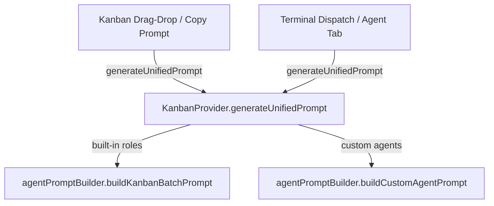

# Unified Prompt Building Architecture

Simplify prompt building triggers across Switchboard to use a single unified entry point. Currently, both `KanbanProvider.ts` and `TaskViewerProvider.ts` resolve configurations and compile option objects independently before calling `buildKanbanBatchPrompt` / `buildCustomAgentPrompt`. This leads to feature drift (e.g. terminal dispatches ignoring Caveman Mode, Suppress Walkthrough, etc. configured in the Prompts tab).

This refactor consolidates all prompt construction into a single public method `generateUnifiedPrompt` in `KanbanProvider.ts`.

## Goal

Consolidate all prompt-building entry points across KanbanProvider and TaskViewerProvider into a single `generateUnifiedPrompt` method on KanbanProvider, eliminating config-resolution duplication and preventing feature drift between kanban-board and terminal-dispatch paths.

## Metadata

- **Tags:** [backend, workflow, reliability]
- **Complexity:** 7

## User Review Required

- Confirm that `generateUnifiedPrompt` should resolve all `PromptBuilderOptions` fields from `_getPromptsConfig` + `_getDefaultPromptOverrides` by default, with callers able to override specific fields via a `Partial<PromptBuilderOptions>` parameter.
- Confirm that `_dispatchWithPairProgrammingIfNeeded` and `_generateAntigravityPrompt` should be updated in this same refactor (vs. deferred to a follow-up).
- Confirm that the `role === 'team'` branch should be deleted outright — it's unreachable (no UI triggers it, pair programming already handles the lead/coder split).

## Complexity Audit

### Routine
- Moving `buildCustomAgentPrompt` from TaskViewerProvider to `agentPromptBuilder.ts` as a pure exported function
- Moving 4 static directive constants (`COMPLEXITY_SCORING_DIRECTIVE`, `TICKET_UPDATE_DIRECTIVE`, `TICKET_REFINE_DIRECTIVE`, `TICKET_RESEARCH_REFINE_DIRECTIVE`) from TaskViewerProvider to `agentPromptBuilder.ts`
- Updating import statements in TaskViewerProvider and KanbanProvider
- Replacing individual `_generateBatch*Prompt` method bodies with delegations to `generateUnifiedPrompt`
- Updating callers of deleted methods to use the new unified entry point
- Deleting the dead `role === 'team'` branch, `_detectPlanBandCoverage`, and related `team` cases — unreachable code
- Deleting rogue string appends (strict/light mode delivery instructions, "Additional Instructions" band-splitting) — these are drift, not features

### Complex / Risky
- Reconciling two different config-resolution strategies: TaskViewerProvider uses individual helper methods (`_isAccurateCodingEnabled()`, `_isSplitPlanEnabled()`, etc.) that read from `workspaceState`, while KanbanProvider uses `_getPromptsConfig()` which reads from VS Code settings + role configs. The unified method must choose one strategy (recommendation: `_getPromptsConfig` as single source of truth).
- Ensuring no `PromptBuilderOptions` fields are silently dropped when switching to the unified method. The current TVP dispatch calls already drop many fields that the kanban board (source of truth) passes. The unified method fixes this by resolving all fields from `_getPromptsConfig`. **Fields currently dropped by TVP dispatches (to be restored by `generateUnifiedPrompt`):**
  - `clearAntigravityContext` — dropped in all TVP dispatch paths
  - `cavemanOutputEnabled` — dropped in all TVP dispatch paths
  - `skipCompilation` — dropped in all TVP dispatch paths
  - `skipTests` — dropped in all TVP dispatch paths
  - `suppressWalkthroughEnabled` — dropped in all TVP dispatch paths
  - `includeDependencyInstructions` — dropped in all TVP dispatch paths
  - `dependencyCheckEnabled` — dropped in TVP planner dispatch
  - `plannerWorkflowPath` — dropped in TVP planner dispatch
  - `routingMapConfig` — dropped in TVP non-planner dispatches
  - `accurateCodingEnabled` — dropped in TVP lead/intern dispatches (only passed for coder)
  - `pairProgrammingEnabled` — dropped in TVP lead/intern dispatches (only passed for coder via pair programming)
  - `aggressivePairProgramming` — dropped in TVP lead/coder/intern dispatches
  - `advancedReviewerEnabled` — dropped in TVP reviewer dispatch (only passed via clipboard copy)
  - `splitPlan` — dropped in TVP planner dispatch (only passed via clipboard copy)

## Edge-Case & Dependency Audit

- **Race Conditions**: Multiple callers (kanban board, sidebar, autoban) may call `generateUnifiedPrompt` concurrently. The existing methods are already async and called concurrently, so no new risk is introduced. No mutex required.
- **Security**: No new security surface. The unified method reads the same config sources as the existing methods. The `_isValidAgentName` check in TaskViewerProvider remains at the dispatch layer, not in prompt generation.
- **Side Effects**: The unified method will be async (reads from DB, filesystem, VS Code settings). Callers must await it. Existing callers already await the methods being replaced.
- **Dependencies & Conflicts**: `CustomAgentAddons` is defined in `agentConfig.ts` (not in `TaskViewerProvider.ts` as the original plan stated). The moved `buildCustomAgentPrompt` function will import it from there. No circular dependency risk — `agentPromptBuilder.ts` already imports from `agentConfig.ts`.

## Dependencies

None

## Adversarial Synthesis

Key risks: (1) The original `generateUnifiedPrompt` signature silently drops 22+ `PromptBuilderOptions` fields, causing feature regression in terminal dispatches. (2) Two different config-resolution strategies exist between TVP and KanbanProvider — choosing the wrong one breaks existing behavior. (3) Rogue strict/light mode string appends in the dispatch layer must be deleted — they are the drift this refactor fixes. Mitigations: Accept `Partial<PromptBuilderOptions>` and resolve missing fields from `_getPromptsConfig`; use KanbanProvider's `_getPromptsConfig` as the canonical config source; delete the rogue appends outright since the kanban board (source of truth) does not produce them.

## Proposed Changes



### Prompt Builder Module

#### [MODIFY] [agentPromptBuilder.ts](file:///Users/patrickvuleta/Documents/GitHub/switchboard/src/services/agentPromptBuilder.ts)

- **Move `buildCustomAgentPrompt`** from `TaskViewerProvider.ts` (lines 6267–6346) to `agentPromptBuilder.ts` as an exported pure function. Signature:
  ```typescript
  export function buildCustomAgentPrompt(
      plans: BatchPromptPlan[],
      promptInstructions?: string,
      addons?: CustomAgentAddons,
      workspaceRoot?: string
  ): string
  ```
  This function already uses only imported utilities (`buildPromptDispatchContext`, `detectWorkspaceType`, `normalizeNewlines`, directive constants) — no `this` references. It is a straightforward extraction.

- **Move 4 static directive constants** from `TaskViewerProvider` (lines 6237–6265) to `agentPromptBuilder.ts`:
  - `COMPLEXITY_SCORING_DIRECTIVE` (TVP line 6237)
  - `TICKET_UPDATE_DIRECTIVE` (TVP line 6243)
  - `TICKET_REFINE_DIRECTIVE` (TVP line 6250)
  - `TICKET_RESEARCH_REFINE_DIRECTIVE` (TVP line 6257)

  The other 8 constants listed in the original plan (`FOCUS_DIRECTIVE`, `GIT_PROHIBITION_DIRECTIVE`, `INLINE_CHALLENGE_DIRECTIVE`, `AGGRESSIVE_PAIR_PROGRAMMING_DIRECTIVE`, `ADVANCED_REVIEWER_DIRECTIVE`, `DEPENDENCY_CHECK_DIRECTIVE`, `SPLIT_PLAN_DIRECTIVE`, `DEEP_RESEARCH_DIRECTIVE`) already exist in `agentPromptBuilder.ts` — no move needed.

- **Add import** of `CustomAgentAddons` from `./agentConfig` in `agentPromptBuilder.ts` (it already imports `DefaultPromptOverride` from there).

---

### Kanban Service

#### [MODIFY] [KanbanProvider.ts](file:///Users/patrickvuleta/Documents/GitHub/switchboard/src/services/KanbanProvider.ts)

1. **Introduce `generateUnifiedPrompt`** — a single public async method:
   ```typescript
   public async generateUnifiedPrompt(
       role: string,
       plans: BatchPromptPlan[],
       workspaceRoot: string,
       overrides?: Partial<PromptBuilderOptions>
   ): Promise<string>
   ```
   This method will:
   - If `role` starts with `custom_agent_`: fetch custom agent config via `_getCustomAgents`, then call the moved `buildCustomAgentPrompt` from `agentPromptBuilder.ts`. Return its result directly.
   - For all built-in roles: resolve `PromptsConfig` via `_getPromptsConfig(workspaceRoot)` and `DefaultPromptOverrides` via `_getDefaultPromptOverrides(workspaceRoot)`.
   - Build a complete `PromptBuilderOptions` object by merging resolved config with caller-provided `overrides` (caller overrides win). The resolution logic per role:
     - `clearAntigravityContext`: `promptsConfig.clearAntigravityContextByRole?.[role] ?? false`
     - `cavemanOutputEnabled`: `promptsConfig.cavemanOutputByRole?.[role] ?? false`
     - `skipCompilation`: `promptsConfig.skipCompilationByRole?.[role] ?? false`
     - `skipTests`: `promptsConfig.skipTestsByRole?.[role] ?? false`
     - `suppressWalkthroughEnabled`: `promptsConfig.suppressWalkthroughByRole?.[role] ?? false`
     - `useSubagentsEnabled`: `promptsConfig.useSubagentsByRole?.[role] ?? false`
     - `includeDependencyInstructions`: `promptsConfig.includeDependencyInstructionsByRole?.[role] ?? false`
     - `switchboardSafeguardsEnabled`: `promptsConfig.switchboardSafeguardsByRole?.[role] ?? true`
     - `gitProhibitionEnabled`: `promptsConfig.gitProhibitionByRole?.[role] ?? true`
     - `defaultPromptOverrides`: from `_getDefaultPromptOverrides`
     - `workspaceRoot`: from parameter
     - `routingMapConfig`: `this._routingMapConfig`
     - Role-specific fields:
       - `planner`: `aggressivePairProgramming`, `dependencyCheckEnabled`, `plannerWorkflowPath`, `designDocLink`, `designDocContent` (fetched from Notion if applicable), `splitPlan`
       - `lead`/`coder`/`intern`: `instruction` (coder/intern → `'low-complexity'`), `pairProgrammingEnabled` (from `this._autobanState`), `accurateCodingEnabled`
       - `reviewer`: `advancedReviewerEnabled`
       - `tester`: `designDocLink`, `designDocContent`
       - `researcher`/`code_researcher`: `researchDepth`, `saveToLocalDocs`, `localDocsPath`
       - `ticket_updater`: `ticketUpdateMode`
       - `splitter`: `complexityScoringSkill`
   - Call `buildKanbanBatchPrompt(role, plans, mergedOptions)` and return the result.

   **Clarification**: The `overrides` parameter allows callers (e.g., terminal dispatch) to override specific fields like `gitProhibitionEnabled` without having to resolve the full config themselves. Fields not provided in `overrides` default to the centralized `_getPromptsConfig` resolution.

2. **Delete the redundant duplicate functions**:
   - `_generateBatchExecutionPrompt` (line 2860)
   - `_generateBatchPlannerPrompt` (line 2815)
   - `_generateBatchTesterPrompt` (line 6748)

3. **Refactor `_generatePromptForDestinationRole`** (line 3129) to:
   - Map `cards` to `plans` via `_cardsToPromptPlans` (with `_buildRepoScopeMap`)
   - Delegate directly to `this.generateUnifiedPrompt(role, plans, workspaceRoot, { sourceColumnLabel })`
   - The current branching logic for planner/reviewer/tester/custom-agent/execution roles is absorbed into `generateUnifiedPrompt`

4. **Update `_dispatchWithPairProgrammingIfNeeded`** (line 2909) to call `generateUnifiedPrompt` for both the lead and coder prompts instead of directly calling `buildKanbanBatchPrompt`.

5. **Update `_generateAntigravityPrompt`** (line 2543) to call `generateUnifiedPrompt` for the planner prompt instead of inline config resolution + `buildKanbanBatchPrompt`.

6. **Update the pair programming lead/coder dispatch** (lines 5708/5726) — currently calls `buildKanbanBatchPrompt` directly with full options resolved inline. Replace with `this.generateUnifiedPrompt('lead', plans, workspaceRoot, { pairProgrammingEnabled: true })` and `this.generateUnifiedPrompt('coder', plans, workspaceRoot, { pairProgrammingEnabled: true })`.

7. **Update the prompt preview** (line 6116) — currently calls `buildKanbanBatchPrompt` directly with full options resolved inline. Replace with `this.generateUnifiedPrompt(role, plans, workspaceRoot, { sourceColumnLabel, instruction })`.

8. **Update the antigravity prompt preview** (line 2300) — same pattern. Replace with `this.generateUnifiedPrompt(role, plans, workspaceRoot)`.

---

### Terminal/Sidebar Service

#### [MODIFY] [TaskViewerProvider.ts](file:///Users/patrickvuleta/Documents/GitHub/switchboard/src/services/TaskViewerProvider.ts)

1. **Delete the redundant private helper methods**:
   - `_buildKanbanBatchPrompt` (line 6181) — 3 callers at lines 2338, 2708, 2758
   - `buildCustomAgentPrompt` (line 6267) — 4 callers at lines 2342, 2762, 12851, 15011

2. **Delete the 4 static directive constants** (moved to `agentPromptBuilder.ts`):
   - `COMPLEXITY_SCORING_DIRECTIVE` (line 6237)
   - `TICKET_UPDATE_DIRECTIVE` (line 6243)
   - `TICKET_REFINE_DIRECTIVE` (line 6250)
   - `TICKET_RESEARCH_REFINE_DIRECTIVE` (line 6257)

3. **Update all terminal dispatches in `_handleTriggerAgentActionInternal`** (line 14580) to delegate prompt generation to `this._kanbanProvider.generateUnifiedPrompt`. All dispatch branches collapse to a single call — no post-call string concatenation:
   - For `role === 'planner'` (line 14881): `messagePayload = await this._kanbanProvider.generateUnifiedPrompt('planner', [dispatchPlan], effectiveWorkspaceRoot, { instruction: plannerInstruction, gitProhibitionEnabled })`. **Delete the rogue `messagePayload +=` blocks** (lines 14898–14912) — these strict/light mode delivery appends are the drift this refactor fixes; the kanban board (source of truth) does not produce them.
   - For `role === 'reviewer'` (line 14913): `messagePayload = await this._kanbanProvider.generateUnifiedPrompt('reviewer', [dispatchPlan], effectiveWorkspaceRoot, { instruction: baseInstruction, gitProhibitionEnabled })`. **Delete the rogue `messagePayload +=` blocks** (lines 14930–14945) — same drift.
   - For `role === 'tester'` (line 14946): `messagePayload = await this._kanbanProvider.generateUnifiedPrompt('tester', [dispatchPlan], effectiveWorkspaceRoot, { gitProhibitionEnabled })`.
   - For `role === 'lead'` (line 14961): `messagePayload = await this._kanbanProvider.generateUnifiedPrompt('lead', [dispatchPlan], effectiveWorkspaceRoot, { includeInlineChallenge, gitProhibitionEnabled })`.
   - For `role === 'coder'` (line 14971): `messagePayload = await this._kanbanProvider.generateUnifiedPrompt('coder', [dispatchPlan], effectiveWorkspaceRoot, { instruction: baseInstruction, includeInlineChallenge, gitProhibitionEnabled })`.
   - For `role === 'intern'` (line 14991): `messagePayload = await this._kanbanProvider.generateUnifiedPrompt('intern', [dispatchPlan], effectiveWorkspaceRoot, { instruction: baseInstruction, includeInlineChallenge, gitProhibitionEnabled })`.
   - For `role === 'gatherer'` (line 15002): `messagePayload = await this._kanbanProvider.generateUnifiedPrompt('gatherer', [dispatchPlan], effectiveWorkspaceRoot, { gitProhibitionEnabled })`.
   - For custom agents (line 15010): `messagePayload = await this._kanbanProvider.generateUnifiedPrompt(role, [dispatchPlan], effectiveWorkspaceRoot)` — the unified method handles custom agent resolution internally.

4. **Delete the dead `role === 'team'` branch** (line 14716). No UI button, pipeline, or service triggers `role === 'team'` — it's unreachable code. The `teamReady` flag is tracked in the sidebar but never used to dispatch. The pair programming feature (`_dispatchWithPairProgrammingIfNeeded` + `pairProgrammingEnabled` flag) already handles the lead/coder split natively. Delete the branch, `_detectPlanBandCoverage`, and the `team` cases in `_codedColumnForRole` / `_targetColumnForRole`.

5. **Update the 3 callers of `_buildKanbanBatchPrompt`** (lines 2338, 2708, 2758) to use `this._kanbanProvider.generateUnifiedPrompt` instead.

6. **Update the 4 callers of `buildCustomAgentPrompt`** (lines 2342, 2762, 12851, 15011) to use `this._kanbanProvider.generateUnifiedPrompt` instead (the unified method handles custom agent resolution).

7. **Update the pair programming coder dispatch** (line 2809) — currently calls `buildKanbanBatchPrompt('coder', validPlans, { pairProgrammingEnabled: true, accurateCodingEnabled, defaultPromptOverrides, workspaceRoot, useSubagentsEnabled })` with only 5 fields. Replace with `generateUnifiedPrompt('coder', validPlans, resolvedWorkspaceRoot, { pairProgrammingEnabled: true })` — the unified method resolves the rest from `_getPromptsConfig`.

8. **Update the clipboard copy prompt** (line 12853) — currently calls `buildKanbanBatchPrompt(role, [plan], { instruction, includeInlineChallenge, accurateCodingEnabled: false, pairProgrammingEnabled, aggressivePairProgramming, splitPlan, advancedReviewerEnabled, designDocLink, defaultPromptOverrides, workspaceRoot, useSubagentsEnabled })` with partial fields. Replace with `generateUnifiedPrompt(role, [plan], resolvedWorkspaceRoot, { instruction: resolvedInstruction, accurateCodingEnabled: false })` — the unified method resolves the rest. The `accurateCodingEnabled: false` override is intentional (clipboard prompts never use accuracy mode).

9. **Update the default prompt previews** (line 3161) — currently calls `buildKanbanBatchPrompt(previewRole, [placeholder])` with zero options. Replace with `generateUnifiedPrompt(previewRole, [placeholder], workspaceRoot)` — the unified method resolves all config from `_getPromptsConfig`.

## Verification Plan

### Automated Tests
- Run ESLint to ensure no syntax/import errors: `npm run lint`
- Execute extension test suites:
  - `npm run test:regression:plan-sync`
  - `npm run test:regression:native-project-api`
  - `npm run test` (unit tests for agentPromptBuilder)

### Manual Verification
1. Launch Extension Development Host.
2. In the Kanban Prompts tab, change settings for `coder` (e.g. check "Caveman Mode", uncheck "Run automated tests").
3. Launch the terminal dispatch for Coder from the Agents tab in `implementation.html` (sidebar).
4. Verify the terminal dispatch payload matches the clipboard-copied prompt and carries the `CAVEMAN MODE` / `SKIP TESTS` instructions correctly.
5. Test a custom agent dispatch to verify `buildCustomAgentPrompt` logic is preserved.
6. Test the team dispatch (`role === 'team'`) to verify lead and coder payloads are generated correctly.

---

**Recommendation**: Complexity 7 → Send to Lead Coder
